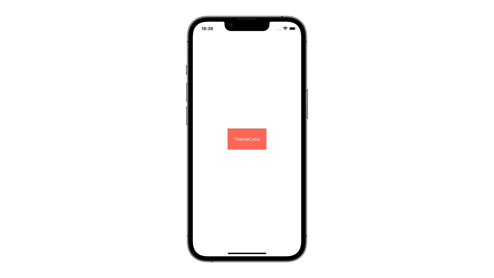

# ColorAsset

## 概要
ColorAssetは、色データを格納しておくオブジェクトのことです。アプリ内で複数回使用したい配色をアセットとして定義しておくことで、簡単に実装することができます。

## 実装方法
1. NavigatorからAssetsを選択する
2. 右クリック>New Color Setを選択する
3. ColorAssetの名前を定義し、色をsRGBやSystem Colorから選択
4. ViewController.swiftからUIColor(named: 定義したColorAssetの名前)で参照できます
