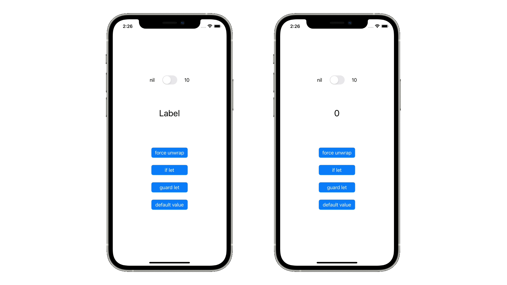

# Optional


## 概要
Swiftの変数は基本的にはnilを許容しませんが、Optional型を使用することでnilを許容する変数を定義することができます。Optional型の宣言をするときは、変数の後ろに`?`を記述します。Optional型にすると、変数の宣言と同時に自動的にnilが代入されます。
以下の2つの例は記述方法が違うだけで、同じ意味です。
```
var a: String?
```
```
var a: Optional<String>
```

## 前提知識
- [if](https://github.com/lifeistech/toybox/tree/main/if)

## 関連
- [UISwitch](https://github.com/lifeistech/toybox/tree/main/UISwitch)
