# toyboxとは
Life is Tech! iPhoneアプリプログラミングコースのサンプルコード集プロジェクトです。
Swiftにはどんな技術があるのか、どんなコードを書けばどのように動くのか見て、触ってみることができます。コードの詰め合わせという意味から、そしてたくさん遊んで欲しいという思いを込めて、おもちゃ箱のtoyboxと名付けられました🎉
Swiftの機能がコンポーネントごとにtoyとして分かれていて、それぞれXcode Projectが作られています👀  

[Scrapbox](https://scrapbox.io/toybox-ios/)からtoyの一覧・toyの相互関係を見ることができます！

### 使い方
1. Githubページ中央の`<> Code`ボタンから`Download ZIP`します
2. ダウンロードしたzipファイルをダブルクリックで展開します
3. それぞれのtoyがフォルダで分かれているので、見たいtoyのフォルダを開きます
4. フォルダ内に入っている`.xcodeproj`の拡張子のファイルをダブルクリックするとXcodeが開きます
5. ダウンロードしたプロジェクトを開くと警告が出る場合がありますが、その場合は`Trust and Open`ボタンを押します
6. READMEにそのtoyの技術について、概要や実装方法が記載されています

# toybox

## Codable
[Codable](https://github.com/lifeistech/toybox/tree/main/Codable)

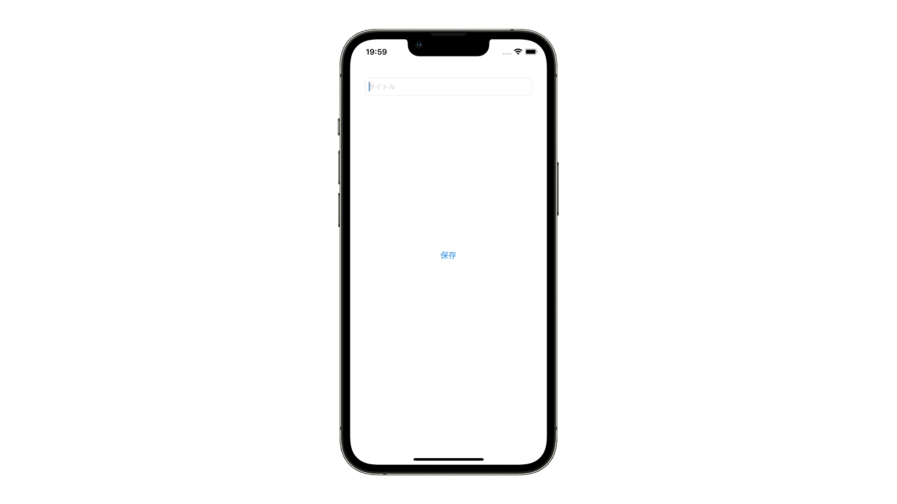

## ColorAsset
[ColorAsset](https://github.com/lifeistech/toybox/tree/main/ColorAsset)

## SFSymbol
[SFSymbol](https://github.com/lifeistech/toybox/tree/main/SFSymbol)

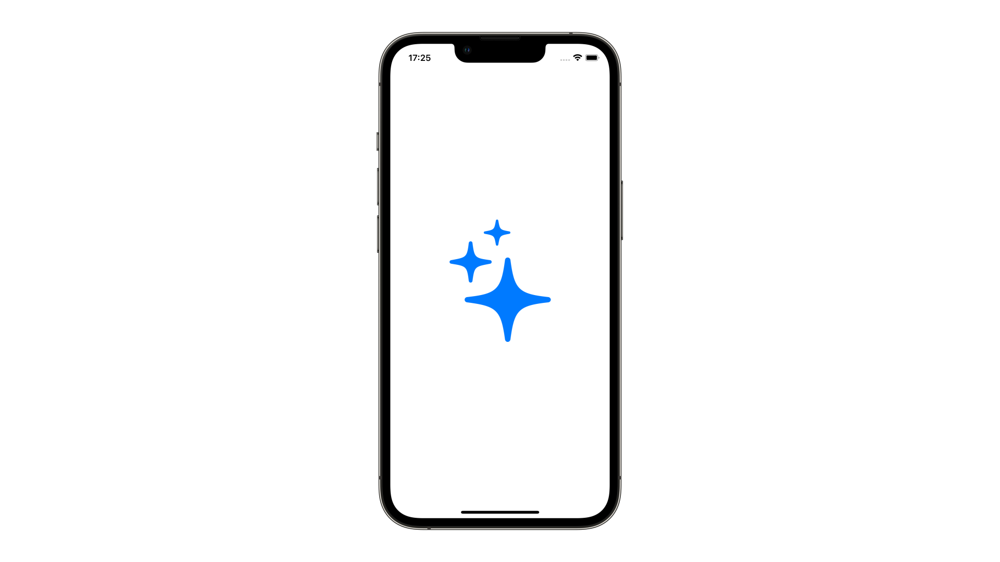

## Speech
[Speech](https://github.com/lifeistech/toybox/tree/main/Speech)

## UIButtonConfiguration
[UIButtonConfiguration](https://github.com/lifeistech/toybox/tree/main/UIButtonConfiguration)

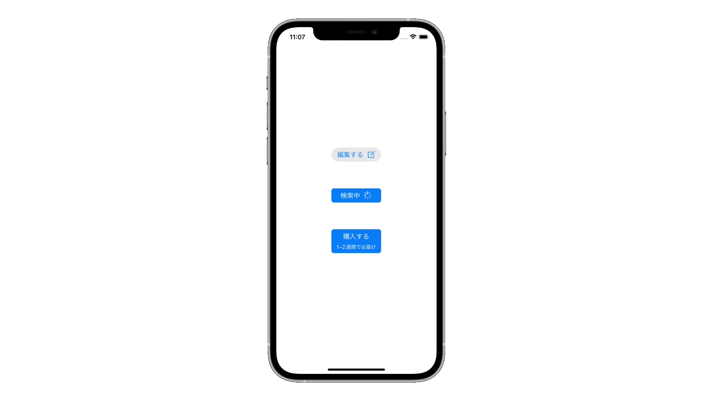

## UIFont
[UIFont](https://github.com/lifeistech/toybox/tree/main/UIFont)

## UIMenu
[UIMenu](https://github.com/lifeistech/toybox/tree/main/UIMenu)

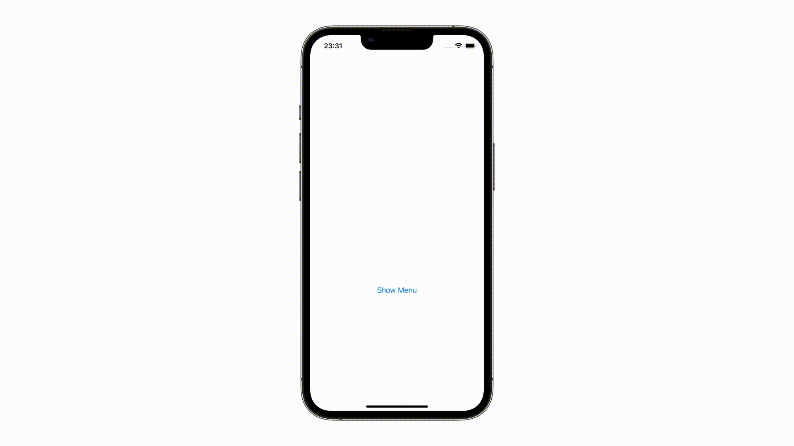

## UINavigationController
[UINavigationController](https://github.com/lifeistech/toybox/tree/main/UINavigationConrtoller)

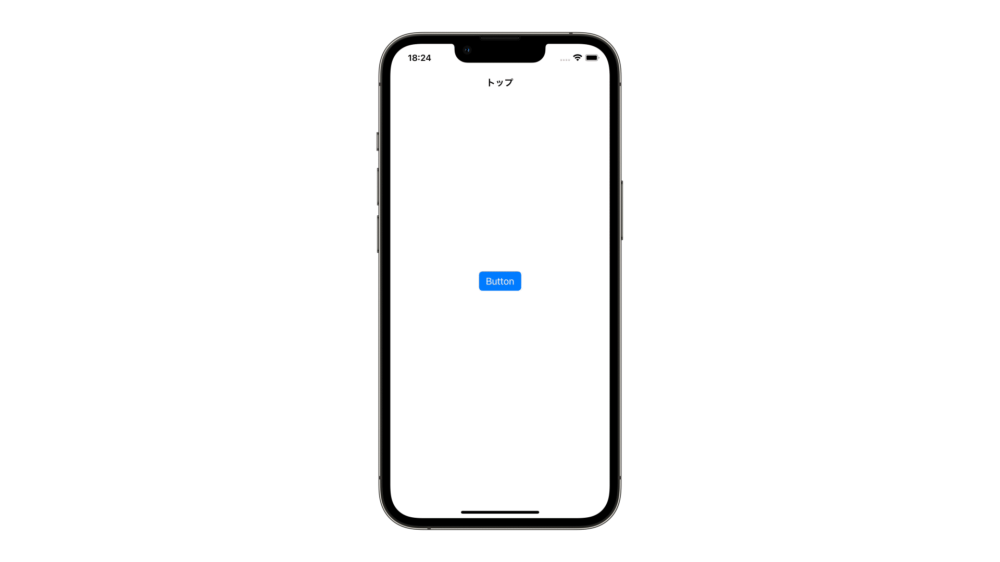

## UIPickerView
[UIPickerView](https://github.com/lifeistech/toybox/tree/main/UIPickerView)

## UISegmentedControl
[UISegmentedControl](https://github.com/lifeistech/toybox/tree/main/UISegmentedControl)

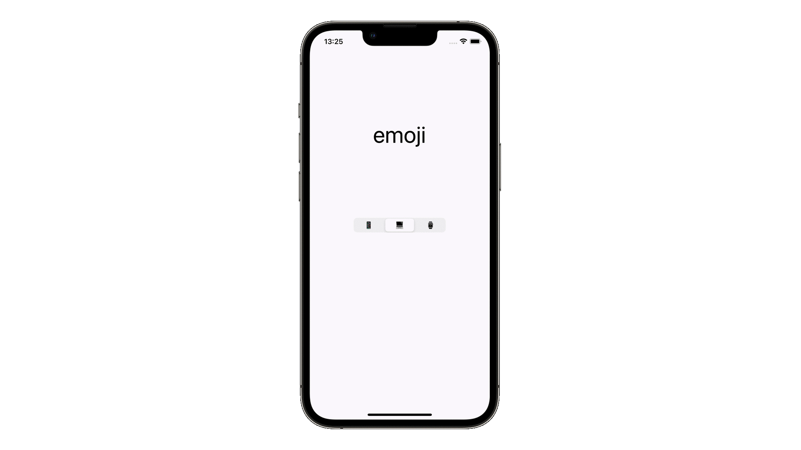

## UISlider
[UISlider](https://github.com/lifeistech/toybox/tree/main/UISlider)

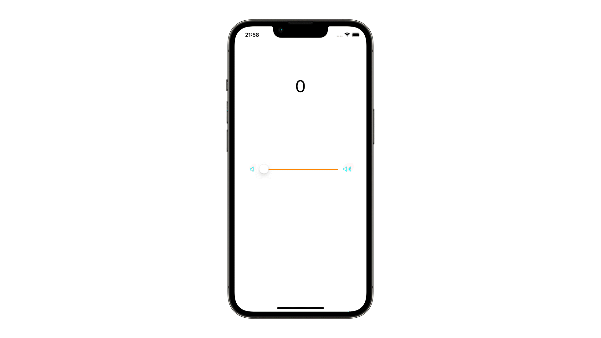

## UISwitch
[UISwitch](https://github.com/lifeistech/toybox/tree/main/UISwitch)

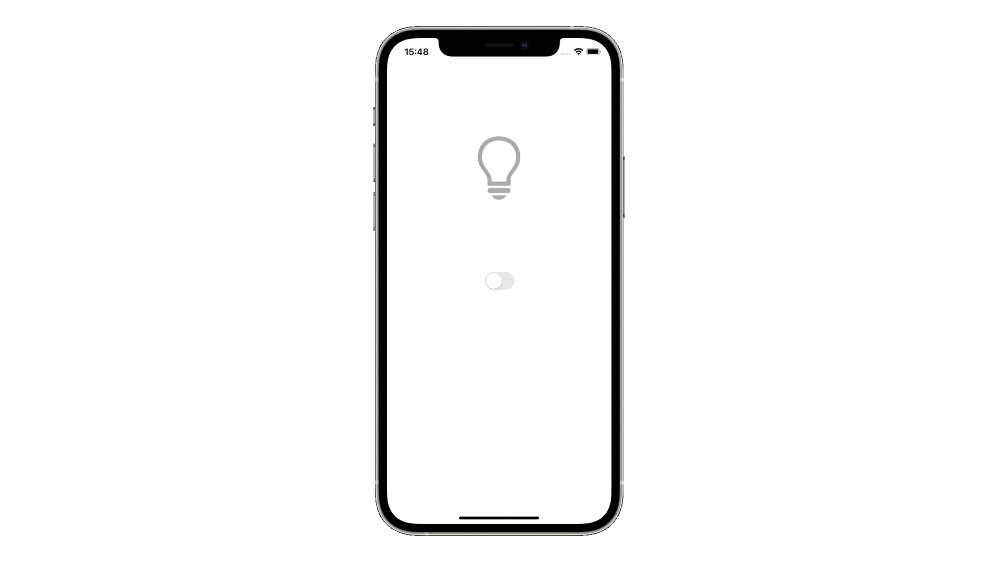

## UITabBarController
[UITabBarController](https://github.com/lifeistech/toybox/tree/main/UITabBarController)

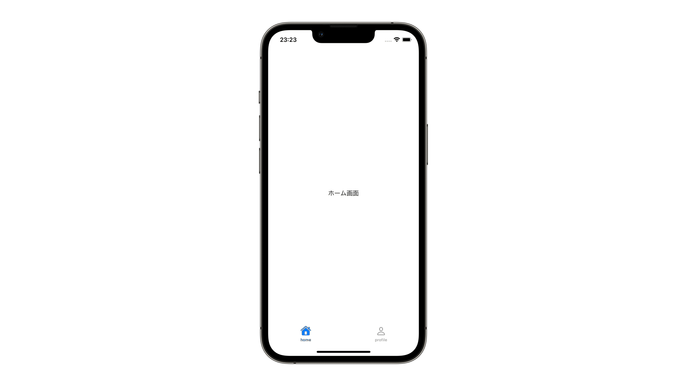

## animation
[animation](https://github.com/lifeistech/toybox/tree/main/animation)

## extension
[extension](https://github.com/lifeistech/toybox/tree/main/extension)

## for
[for](https://github.com/lifeistech/toybox/tree/main/for)

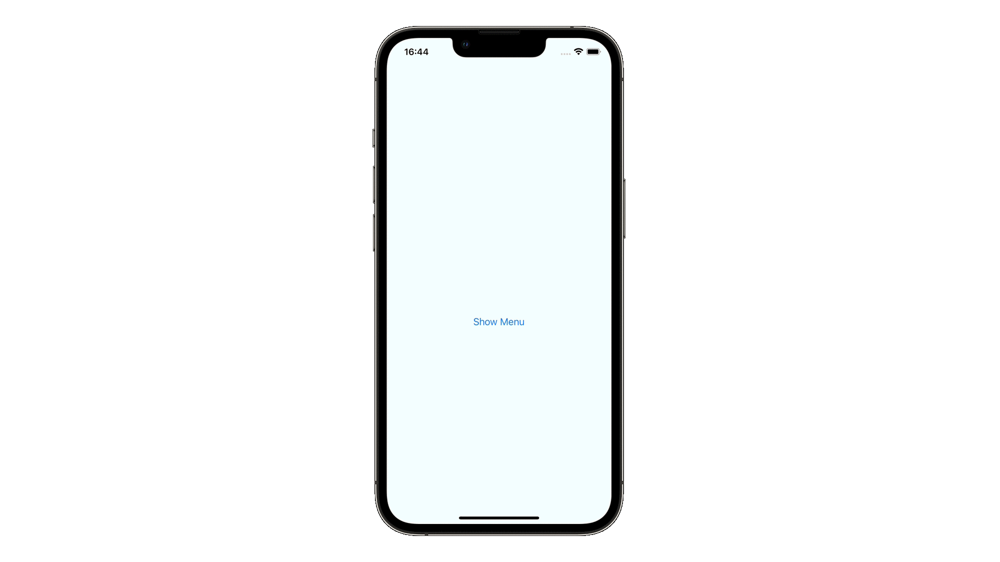

## if
[if](https://github.com/lifeistech/toybox/tree/main/if)

## switch
[switch](https://github.com/lifeistech/toybox/tree/main/switch)

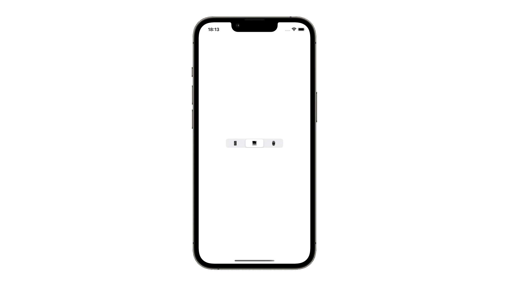

---------------------------------------

## コントリビューション
コントリビューションは大歓迎です。

1. Forkする
2. 自分のブランチを作成する (git checkout -b feature/hogehoge)
3. 変更をコミットする (git commit -m 'Add some feature')
4. ブランチにプッシュする(git push origin hogehoge)
5. 新しいPull Requestを作成する

## Contribution
Contributions are more than welcome!

1. Fork it
2. Create your feature branch (git checkout -b featyre/hogehoge)
3. Commit your changes (git commit -m 'Add some feature')
4. Push to the branch (git push origin hogehoge)
5. Create new Pull Request
