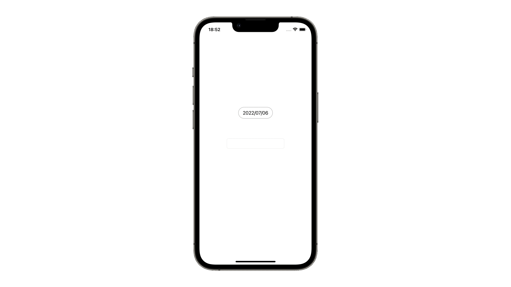

# toybox

## Codable
[Codable](https://github.com.lifeistech/toybox/tree/main/Codable)

## ColorAsset
[ColorAsset](https://github.com.lifeistech/toybox/tree/main/ColorAsset)

## SFSymbol
[SFSymbol](https://github.com.lifeistech/toybox/tree/main/SFSymbol)

## Speech
[Speech](https://github.com.lifeistech/toybox/tree/main/Speech)

## UIButtonConfiguration
[UIButtonConfiguration](https://github.com/lifeistech/toybox/tree/main/UIButtonConfiguration)

## UIFont
[UIFont](https://github.com/lifeistech/toybox/tree/main/UIFont)

## UIMenu
[UIMenu](https://github.com/lifeistech/toybox/tree/main/UIMenu)

## UINavigationController
[UINavigationController](https://github.com/lifeistech/toybox/tree/main/UINavigationConrtoller)

## UIPickerView
[UIPickerView](https://github.com/lifeistech/toybox/tree/main/UIPickerView)

## UISegmentedControl
[UISegmentedControl](https://github.com/lifeistech/toybox/tree/main/UISegmentedControl)

## UISlider
[UISlider](https://github.com/lifeistech/toybox/tree/main/UISlider)

## UISwitch
[UISwitch](https://github.com/lifeistech/toybox/tree/main/UISwitch)

## UITabBarController
[UITabBarController](https://github.com/lifeistech/toybox/tree/main/UITabBarController)

## animation
[animation](https://github.com/lifeistech/toybox/tree/main/animation)

## extension
[extension](https://github.com/lifeistech/toybox/tree/main/extension)

## switch
[switch](https://github.com/lifeistech/toybox/tree/main/switch)

---------------------------------------

## コントリビューション
コントリビューションは大歓迎です。

1. Forkする
2. 自分のブランチを作成する (git checkout -b feature/hogehoge)
3. 変更をコミットする (git commit -m 'Add some feature')
4. ブランチにプッシュする(git push origin hogehoge)
5. 新しいPull Requestを作成する

## Contribution
Contributions are more than welcome!

1. Fork it
2. Create your feature branch (git checkout -b featyre/hogehoge)
3. Commit your changes (git commit -m 'Add some feature')
4. Push to the branch (git push origin hogehoge)
5. Create new Pull Request

