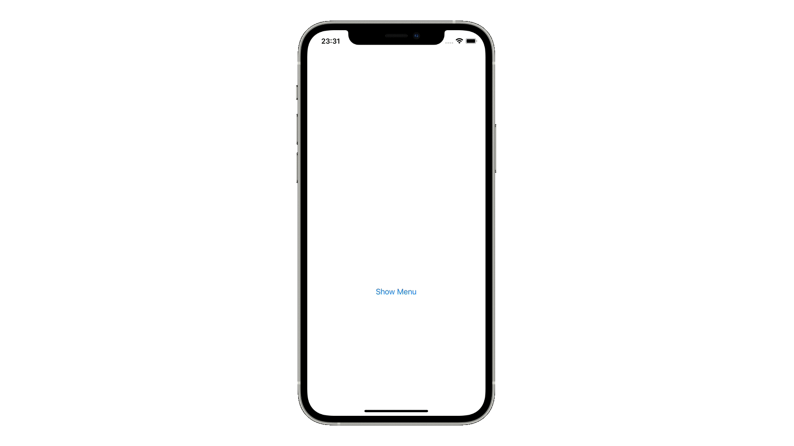

# toybox

## UISwitch
[UISwitch](https://github.com/lifeistech/toybox/tree/main/UISwitch)

## UIButtonConfiguration
[UIButtonConfiguration](https://github.com/lifeistech/toybox/tree/main/UIButtonConfiguration)

## UIMenu
[UIMenu](https://github.com/lifeistech/toybox/tree/main/UIMenu)

## UISegmentedControl
[UISegmentedControl](https://github.com/lifeistech/toybox/tree/main/UISegmentedControl)

## UIFont
[UIFont](https://github.com/lifeistech/toybox/tree/main/UIFont)

## UIPickerView
[UIPickerView](https://github.com/lifeistech/toybox/tree/main/UIPickerView)

---------------------------------------

## コントリビューション
コントリビューションは大歓迎です。

1. Forkする
2. 自分のブランチを作成する (git checkout -b feature/hogehoge)
3. 変更をコミットする (git commit -m 'Add some feature')
4. ブランチにプッシュする(git push origin hogehoge)
5. 新しいPull Requestを作成する

## Contribution
Contributions are more than welcome!

1. Fork it
2. Create your feature branch (git checkout -b featyre/hogehoge)
3. Commit your changes (git commit -m 'Add some feature')
4. Push to the branch (git push origin hogehoge)
5. Create new Pull Request

