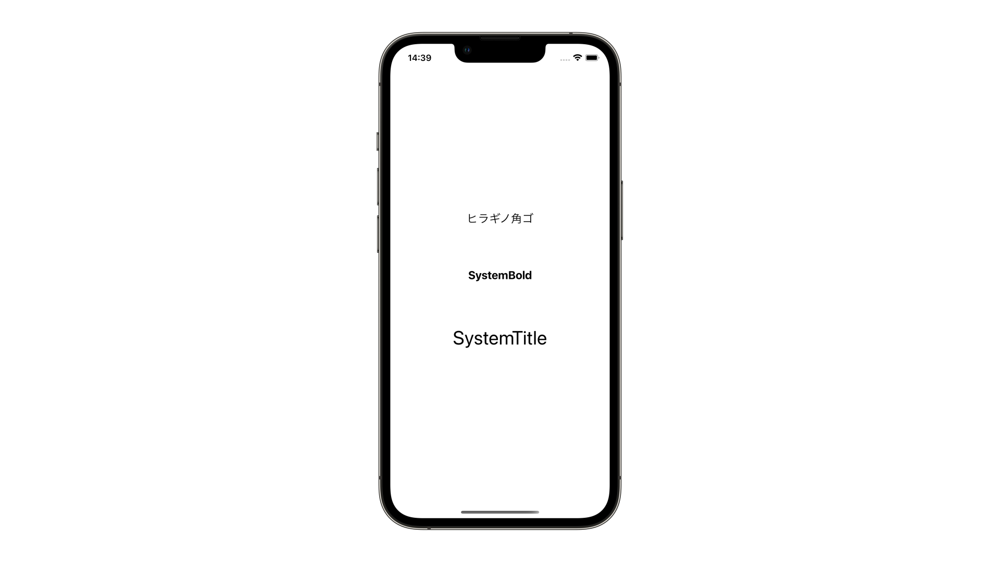

# toybox

## UISwitch
[UISwitch](https://github.com/lifeistech/toybox/tree/main/UISwitch)

## UIButtonConfiguration
[UIButtonConfiguration](https://github.com/lifeistech/toybox/tree/main/UIButtonConfiguration)

## UIMenu
[UIMenu](https://github.com/lifeistech/toybox/tree/main/UIMenu)

## UISegmentedControl
[UISegmentedControl](https://github.com/lifeistech/toybox/tree/main/UISegmentedControl)

## UIFont
[UIFont](https://github.com/lifeistech/toybox/tree/main/UIFont)

## UIPickerView
[UIPickerView](https://github.com/lifeistech/toybox/tree/main/UIPickerView)

