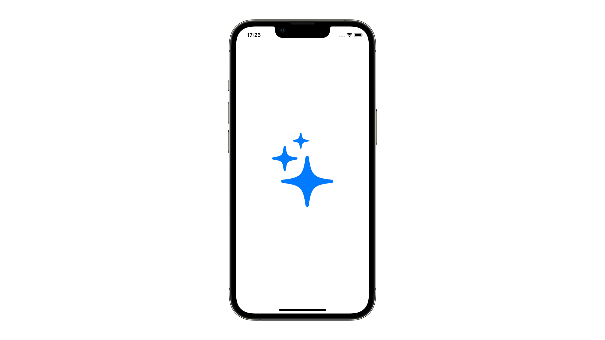

# SFSymbol

## 概要
SFSymbolは、Appleのシステムフォントと違和感なく統合できるように作られた記号や図のライブラリです。それぞれのシンボルは9つの太さの種類と3つのスケールから構成されています。こちらの[公式ガイドライン](https://developer.apple.com/design/human-interface-guidelines/foundations/sf-symbols)から、アプリをダウンロードすることで、アプリ上でシンボルを検索したり、配色を試したりすることができます。

## どう使われているか
- iPhoneのコントロールセンターのアイコン
- 集中モードで選べるアイコン
- ButtonやTabBarのアイコン

## 関連
- [UIButtonConfiguration](https://github.com/lifeistech/toybox/tree/main/UIButtonConfiguration)
- [UIMenu](https://github.com/lifeistech/toybox/tree/main/UIMenu)
- [UISwitch](https://github.com/lifeistech/toybox/tree/main/UISwitch)
- [UISlider](https://github.com/lifeistech/toybox/tree/main/UISlider)
