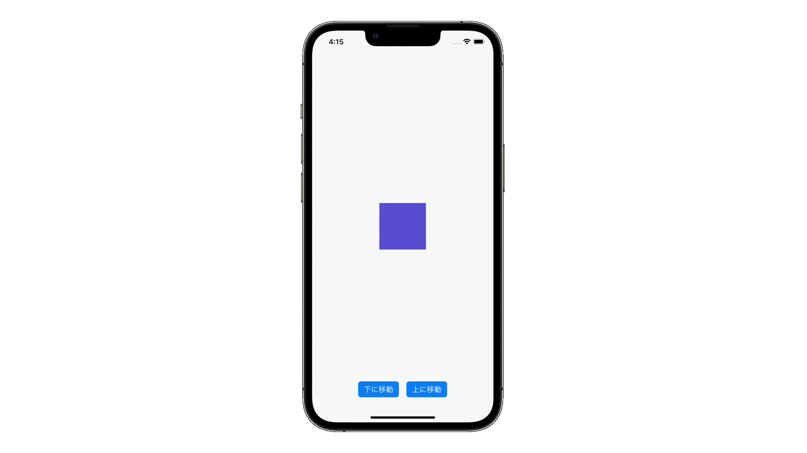

# Trailing Closure


## 概要
TrailingClosureは、引数にクロージャを持つときに、引数ラベルを省略できる記法です。これを使うことによって、プログラムのネスト(入れ子の構造)をシンプルにすることができ、読みやすいコードを書くことができます。

Closureで書いたコード
```
UIView.animate(withDuration: 0.3, delay: 0, options: [], animations: {
  self.view.alpha = 0
}) { _ in
  self.view.removeFromSuperview()
}
```
TrailingClosureで書いたコード
```
UIView.animate(withDuration: 0.3, delay: 0, options: []) {
  self.view.alpha = 0
} completion: { _ in
  self.view.removeFromSuperview()
}
```


## 関連
- [animation](https://github.com/lifeistech/toybox/tree/main/animation)
