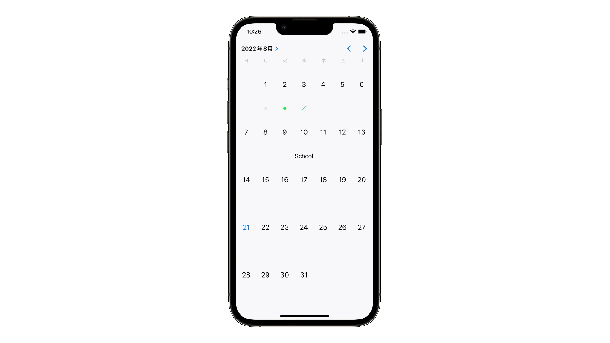

# UICalendarView

## 概要
UICalendarViewはカレンダーを表示し、日付を1日または複数日選択することができます。フォントの種類や日付の文字色の変更、SFSymbolを表示したりなどカレンダーの見た目を簡単にカスタマイズすることもでき、イベントなどの予定の表示も可能です。こちらはiOS16から使用できるコンポーネントとなっています。現状は、Xcode 14 以上、iOS 16以上で動作かつ、Storyboardからレイアウトに追加することができないのでコードで生成する必要があります。

## どう使われているか
- デフォルトのカレンダーアプリ

## 前提知識 
- [switch](https://github.com/lifeistech/toybox/tree/main/switch)
- [extension](https://github.com/lifeistech/toybox/tree/main/extension)
- [if](https://github.com/lifeistech/toybox/tree/main/if)

## 関連
- [SFSymbol](https://github.com/lifeistech/toybox/tree/main/SFSymbol)
