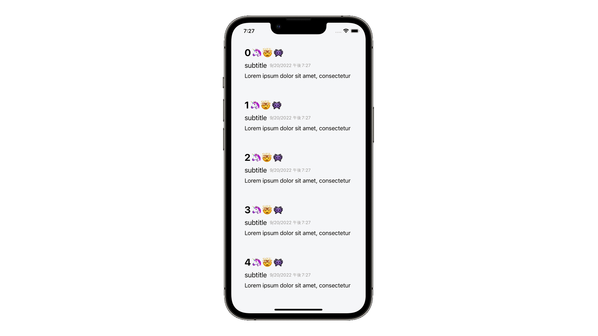

# UIHostingConfiguration

## 概要
UIHostingConfigurationとは、UITableView/UICollectionViewのCellレイアウトをSwiftUIで作るためのコンポーネントです。xibやカスタムのSwift Classを定義することなく複雑なCellレイアウトを実現することができます。また、従来のUIHostingController を使った方法よりも少ないコードで SwiftUI を取り入れることができるメリットがあります。WWDC22で発表され、Xcode14.0/iOS16以降で動作します。

## 前提知識 
- [extension](https://github.com/lifeistech/toybox/tree/main/extension)
- UICollectionView

## 関連
- SwiftUI
