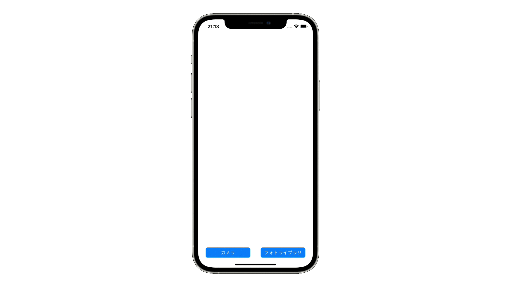

#  UIImagePicker

## 概要
UIImagePickerは、端末のカメラで撮影した写真、またはフォトライブラリにある写真を取得します。`.sourceType = .camera`でカメラ撮影を、`.sourceType = .photoLibrary`でメディアソースから写真を取得することができます。使用するためには、端末にカメラへのアクセスと写真へのアクセス権限をリクエストする必要があります。

## どう使われているか
- 設定のiCloudプロフィール画像の選択画面
- メールアプリの添付画像の撮影画面
- ミュージックアプリのプレイリストカバー画像選択

## 実装方法
1. Info.plist に Privacy - Camera Usage Description と Privacy - Photo Library Usage Descriptionを追加します
2. Main.storyboardにImageViewを配置します
2. ViewController.swiftから`UIImagePickerController()`で参照することができます

## 前提知識 
- [extension](https://github.com/lifeistech/toybox/tree/main/extension)

## 関連
- AVCapturePhotoOutput
