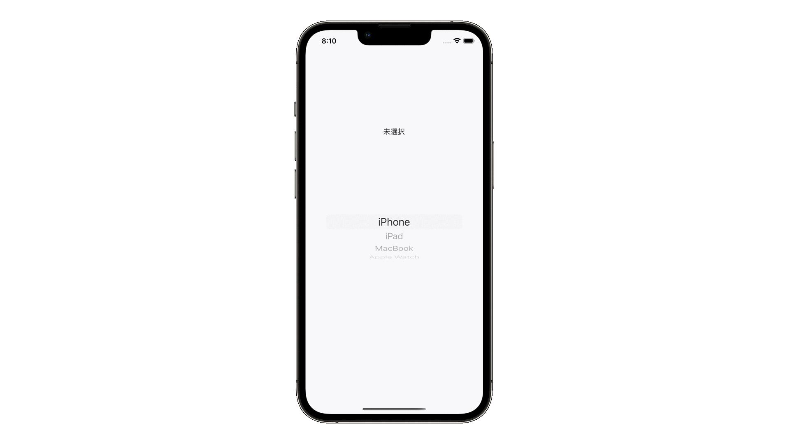

# UIPickerView
<!-- GIF -->

## 概要
UIPickerViewとは何
複数の選択肢から1つを選ばせるView。ドラムロールのように回転させて要素を選ぶのが特徴。

## どう使われているか
- ヘルスケアアプリの血液型選択

<!--## 前提知識 -->
<!--- [snippet名](https://githubの個別readmeへのリンク)-->
<!---->
<!--## 関連-->
<!--- [snippet名](https://githubの個別readmeへのリンク)-->
