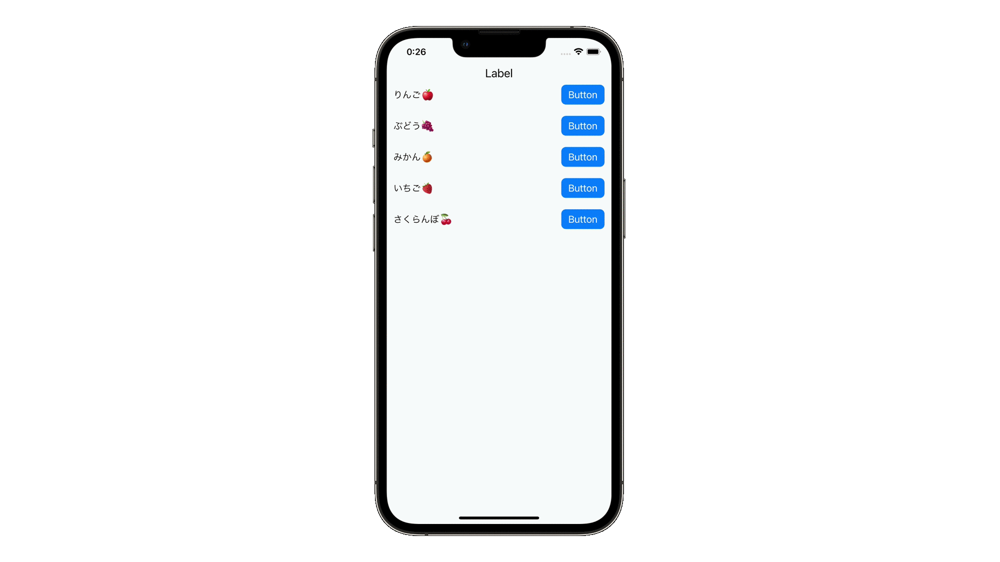

# delegate

## 概要
delegateは、英語で「人に任せる」という意味である通り、他のクラスに処理を任せるものです。delegateを活用することで条件によって処理を変える場合など複数パターンの実装が簡単になります。

### delegateの実装に必要な役割
1. protocol  
    任せる処理をデリゲートメソッドとして定義します。
2. 処理を任せるクラス  
    ボタンを押された時などにデリゲートメソッドで実装した処理を呼び出します。その際にprotocolを実装したクラスのインスタンスを変数delegateに設定します。
3. 処理を任されるクラス  
    定義したデリゲートメソッドの処理を実装します。

## 前提知識 
- [extension](https://github.com/lifeistech/toybox/tree/main/extension)

## 関連
- UICollectionView
