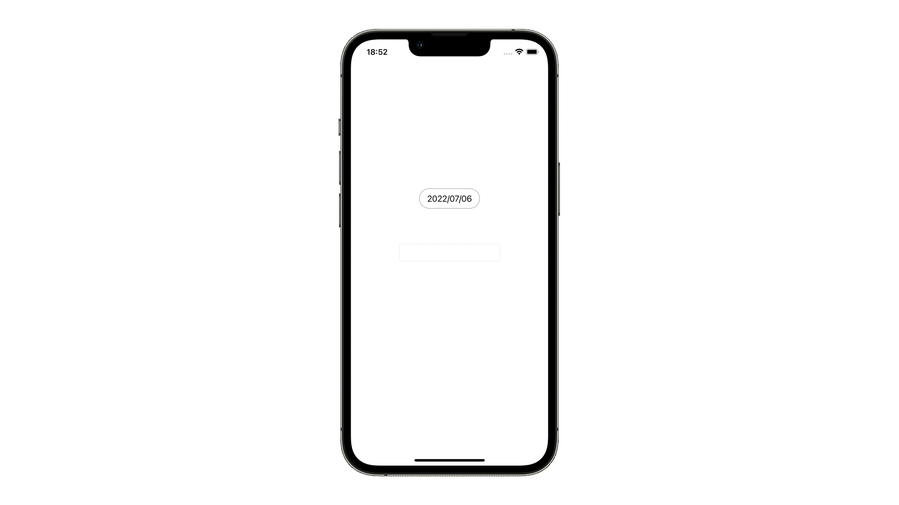

# extension

## 概要
extensionは、”拡張する"という意味で、このコードを書くことでクラスや型に対して機能を拡張します。extensionにwhereを付加した場合、型が条件を満たす場合のみ有効になる定義を追加することもできます。

## 関連
- [UIPickerView](https://github.com/lifeistech/toybox/tree/main/UIPickerView)
