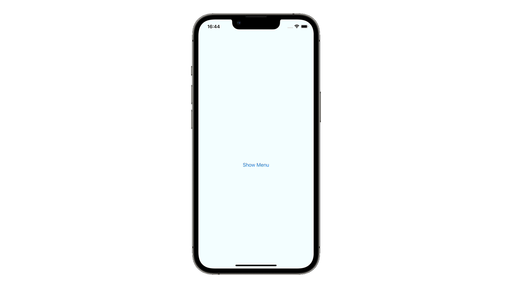

# for

## 概要
forは、条件が真(true)の場合に繰り返し処理を書くときの構文。ループ処理とも呼ばれます。for文でループの数を数えながら繰り返す処理、for-in文で配列の要素を変数に代入しながら繰り返す処理、fforEach文で配列の要素の数だけ繰り返す処理など、記述方法が複数あります。

## 関連
- [enum](https://github.com/lifeistech/toybox/tree/main/enum)
- [SwiftCharts](https://github.com/lifeistech/toybox/tree/main/SwiftCharts)
- [UIMenu](https://github.com/lifeistech/toybox/tree/main/UIMenu)
- [UNUserNotification](https://github.com/lifeistech/toybox/tree/main/UNUserNotification)
